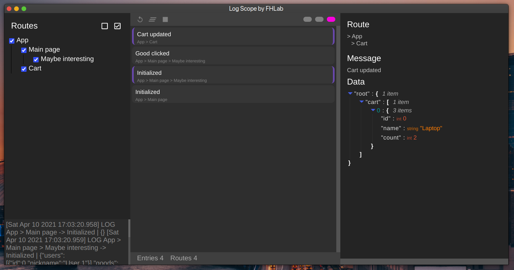
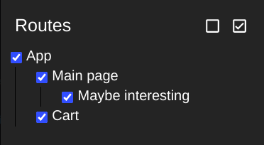

# Log Scope 🔔
[](https://app.circleci.com/pipelines/github/For-Humans-Lab/log-scope-app?branch=master)

The app that provides you a better tool to monitor your rn application and debug it via log messages

## ⬇️ Installation 
Pick a tool according to your OS:
1. `npm i @for-humans-lab/log-scope-linux-app`
2. <strike>`npm i @for-humans-lab/log-scope-mac-app`</strike> (Under construction 🔨)
3. <strike>`npm i @for-humans-lab/log-scope-win-app`</strike> (Under construction 🔨)

⚠️ **Some of a RN CLI files will be automatically patched. In other words, it slightliy changes the watch's tool behaviour in case of console use** ⚠️

## ✅ Usage 
The appliсaction handles all text messages from dev server's output in the specified format that are considered as 

(`route parts separated by '>'` -> `text message` | `data in JSON`.)

e.g. `App > Cart -> Init | {}`


All this templating works are **done** by [Log Scope Driver lib](https://github.com/For-Humans-Lab/log-scope)


Just follow the driver [installation instructions](https://github.com/For-Humans-Lab/log-scope#usage)

After [a successful installation](https://github.com/For-Humans-Lab/log-scope-app#installation) you can lunch the app: `npx log-scope`



### 🚀 Launching RN dev server
Press the `play` button in menu to start the server.
The state of the server are shown in a `status panel`.

- 🔵 The server is active
- 🟠 Bindling
- 🟣 App is running

🚀 To start bundling send an refresh signal (`refresh button`) to an remote app

After a successful launch logs will be rapidly colleted by **Log Scope**.

### 👀 Filtering
All log events have their routes, which are specified in a [registration](https://github.com/For-Humans-Lab/log-scope#logger-registration) stage.

Next routes 
```typescript
["App", "Main page", "Maybe interesting"]
["App", "Main page"]
["App", "Cart"]
```
have the following **filtering tree**



All routes are matched per part.

### Other stuff
Also app contains:
- ⚠️ Pretty traceback reader
- 💅 Json data reader

### 🚄 Performance
In fact of internal implementation of node's `child_process`, each log entry walks through the following way: **app** > **http transport** > **dev server** > **pipes** > **Log Scope**. It makes possible to send a near `unlimited amount of data` in each log entry `🔥without performance loses🔥`


## ⚒ Development 

According to a environmental dependency of an application (RN CLI), you have to explicitly set the `DEV_APPLICATION` variable to your app's folder: `/home/<USER>/repos/<app folder>`.

So you can run the log scope in development mode:
`npm run dev` for dev server and `npm run start` for app launch.


## 🔄 Releases 

Packages are automatically published when some changes were merged in the master branch

## 👐 Contribution
Feel free to create `PRs`.